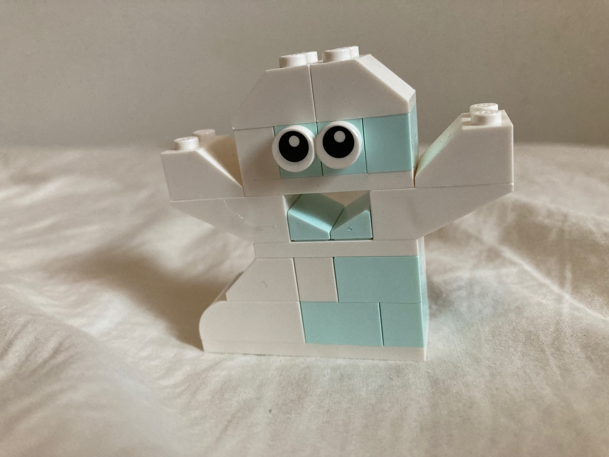

```{r setup, include=FALSE}
knitr::opts_chunk$set(echo = TRUE)
library(vembedr)
library(tidyverse)
library(webexercises)
```

# UHUUU!

Testings


{width="100%"}

<br> <br>

### Opgaver 

#### Opgave 1 

220 + 175 = ?

`r hide("Løsning")`

220 + 175 = 395

`r unhide()`


#### Opgave 2

530  + 190 = ?

`r hide("Løsning")`

530 + 190 = 720

`r unhide()`


##### Opgave 3

55 + 65 = ? 

`r hide("Løsning")`

55 + 65 = 120

`r unhide()`


#### Opgave 4 

365 + 90 = ?

`r hide("Løsning")`

365 + 90 = 455

`r unhide()`


<br> <br>


<!-- ### Jeg åbner en pakke pokemonkort -->

<!-- {width="100%"} -->

<!-- <br> <br> -->

### Jeg prøvesmager et sodavandsmix

```{r, echo=FALSE}
#knitr::include_url("https://www.youtube.com/embed/9bZkp7q19f0", height="200")
#knitr::include_url("https://www.youtube.com/embed/PjHI5SJHGU8")
#knitr::include_url("https://www.youtube.com/watch?v=PjHI5SJHGU8",height = "200px")
#knitr::include_url("https://www.youtube.com/embed/PjHI5SJHGU8", height = "100px")
#embed_url("https://www.youtube.com/watch?v=PjHI5SJHGU8")
embed_url("https://www.youtube.com/watch?v=Ck9iDBAc1X0&t=149s")
```

<br> <br>

<!-- *-Slut-* -->
